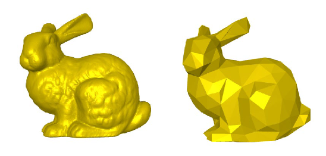

# York-Steganography-Dissertation

This project was about hiding information into three dimensional shapes in a process called 3D steganography.

There are many ways to do this but i based my version mainly off this paper:

Firstly the mesh is partitioned

Then the information is embedded into each of these partitioned.
Information is embedded cryptographically by hiding it into the spacial properties of the object.
This causes minor deformations in the object which makes it differ from the original.
The aim is to cause the least amount of deformation and maximise the amount of data inputted into it.

Above you can see the original mesh and the watermarked mesh on the left.
On the right you can see the two models superimposed to show the slight deviations of the watermarked model's spacial gemoetry 

This information also needs to be succesfully extracted out of the object intact.
While tricky this can be done without problems every time.
However the object may have gone under attacks to its geometry which make it harder to succesfully extract the information.
These attacks are as follows

Noise attack which adds noise to the vertices of the object:

Smoothing attack which smooths the object moves around the vertices:

Mesh simplification which removes vertices and thus information:

Mesh cropping which also removes vertices:

